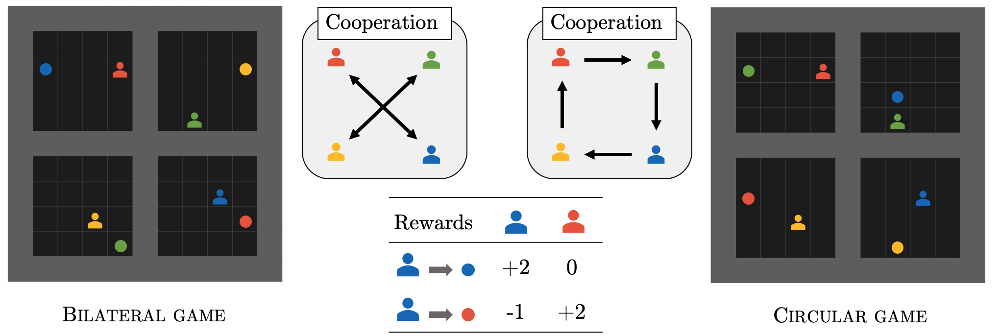

# Asymmetric and Circular Sequential Social Dilemmas with Reinforcement Learning and Graph-based Tit-for-Tat

## Requirements
- Python: requirements.txt
- graphbasedTFT and circular_collect (see Installation below)
- Other: ffmpeg (for video rendering)

## Installation

To create a virtual environment:

* Download files on your machine and go to the main directory
  ```
  git clone https://github.com/submission-conf/neurips_cooperativeAI.git
  cd neurips_cooperativeAI
  ```

* Create a virtual environment and activate it
  ```
  python3 -m venv RL_circular_cooperation
  source RL_circular_cooperation/bin/activate
  ```

* Load the python librairies needed from the requirements file
  ```
  python -m pip install --upgrade pip
  python -m pip install --upgrade setuptools
  python -m pip install -r requirements.txt
  ```


* Install our package graphbasedTFT from previous work (under review), the graph-based Tit-for-Tat. 
  ```
  git clone https://github.com/submission-conf/graphbasedTFT.git
  cd graphbasedTFT
  pip3 install -e .
  cd ..
  ```

* Install our Gym circular game, the package circular_collect:
  ```
  git clone https://github.com/submission-conf/circular_games.git
  cd circular_games/circular_collect
  pip3 install -e .
  cd ../..
  ```


## Simulation of games
In the script `main_demo.py`, it is possible to run some games with agents using the grTFTrl algorithm.
Rendering videos are possible if ffmpeg is installed.

### Preset simulations
In the header of the script, `choice_demo = ` can be set to one index for preset simulations.
Here are the proposed simulations: 
1. graph-based TFT in Circular Game


3. graph-based TFT in Bilateral Game 
4. vanilla TFT in Circular Game   
5. vanilla TFT in Bilateral Game
6. graphTFT + 1 Traitor (defects for t in [30,50] in Circular Game   
7. graphTFT + 1 Traitor (defects for t in [30,50] in Bilateral Game
8. graphTFT in a Dynamic Game 

## Evaluation of parameters
The script `main_eval.py` computes some metrics (mean/standard deviation, because of the high stochasticity of the games):
- Efficiency
- Incentive-Compatibility
- Safety


In the header of the script, parameters can be modified for the selection of parameters for evaluation:
* `choice_env`:
    - `'C'` (circular)
    - `'B'` (bilateral)
* `choice_tft`:
    - `'gr'` (graph-based Tit-for-Tat)
    - `'va'` (vanilla Tit-for-Tat)
    - `'eg'` (egoist)
    - `'ni'` (nice)
* `parameters_TFT`:
    - `alpha`: inertia
    - `r0`: coefficient of incentive (initial)
    - `beta`: coefficient to adapt the incentive r
    - `gamma`: coefficient of stochasticity (incentive with proba gamma)


## Details on games
The Bilateral and Circular games we use in this repo are from our [Circular Collect Game](https://github.com/submission-conf/circular_games).



